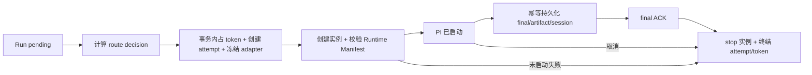

# 混合 PI 执行复用 AgentRun 与 provisioner

状态：accepted
类型：architecture
Owner：`backend/package/yuxi/services/run_worker.py`

## 问题

Yuxi 当前只执行 LangGraph Agent，仓库没有 PI Runner 或 PI 依赖。普通请求已经拥有持久化排队、运行、运行尝试、lease、取消、终态和输出事务；沙盒已经拥有本机 Docker、Kubernetes 与测试 Memory backend。直接再建一套 Task、attempt 或沙盒控制面会产生并行事实，直接把腾讯实现塞进当前文件工具 backend 又无法表达 attempt 选路、运行时校验、结果 ACK 和按 attempt 清理。

当前链路从 `POST /api/agent/runs` 进入 `run_submission_service.submit_run_command`，由 `agent_request_queue_service` 在 PostgreSQL 中写入 Message 和运行请求，提交事务后才向 ARQ 投递运行。`run_worker.process_agent_run` 取得 lease 并创建运行尝试，固化运行清单后执行 LangGraph；输出 Message、运行输出指针与 `completed` 终态在一个事务内提交。取消以 PostgreSQL `cancel_requested` 为事实，Redis 只加速通知。

## 决策

新增一个位于 `yuxi.services` 的深 PI 执行模块，由 `run_worker` 把待执行的 Run 交给该模块。调用方继续只提交运行请求、取消运行并读取既有 Run SSE/结果，不感知 Local 或 Tencent。模块先计算 route decision，再交给 `AgentRunRepository`；repository 在同一事务中占用全局 token、创建运行尝试、写入 `started_at` 并冻结 adapter。事务回滚或 claim 被拒时不产生 token；提交后 token 由开放 attempt lease 拥有，进程失联时由既有 lease reconciler 释放。模块只在该事务提交后创建实例、校验运行时并执行 PI，最后返回已持久化的执行结局。

模块内部新增一个真实 adapter seam，最小 interface 为 `create`、`execute`、`inspect`、`stop`。Local Adapter 复用 `ProvisionerClient`、provisioner 认证代理和现有 agent-sandbox 数据面；Tencent Adapter 实现同一 interface。adapter 不拥有运行终态、重试或结果幂等，测试使用 fake adapter。当前 `docker/sandbox_provisioner/app.py` 中 `create/discover/list/delete` 的隐式 backend interface 继续作为 Local Adapter 的内部实现，不提升为业务调用方可见 interface。

`AgentRunRequest`、`AgentRun` 和 `AgentRunAttempt` 继续分别拥有请求、业务运行和执行占有事实。`AgentRunAttempt` 增加本次选定的 adapter、instance、route reason、指标快照、规则版本、运行时清单及其 digest；token、选路与 attempt 创建在一个事务中绑定，`started_at` 写入后不可改写 adapter。只有能证明 PI 未启动且旧实例已停止时，worker 才能结束当前尝试并创建另一尝试；PI 已启动后的实例失联写成 `failed` + `error_type=execution_unknown`，不新增 Run 终态词汇，也不自动换端。

现有 `agent_run_manifest_service` 的规范化 JSON、SHA-256 和 Skill `content_hash` 可复用。现有 `AgentRun.manifest` 仍表示首次 LangGraph 执行资产，不改写其语义；PI 的 Runtime Manifest 按运行尝试保存，并补齐 Runner 协议、PI/Node 版本与 digest、只读 Skill bundle 清单与逐项 digest、timeout 和工具权限策略。adapter 在启动 PI 前回报并校验实际值，不匹配时以 `runtime_mismatch` 结束未启动的尝试。

现有 Redis Run event envelope 继续作为 SSE 投影，现有 assistant Message、`output_message_id` 与终态事务继续拥有最终文本结果。PI 执行模块新增一个内部 Result Sink seam，接收统一 envelope 并按稳定 `event_id` 幂等处理；final 只有在当前运行尝试仍有效、文本结果与 artifact/session manifest 已持久化后才返回 ACK。当前线程 outputs 只覆盖本机/PVC 文件，没有跨腾讯沙盒的上传、digest 或 PI session Owner，因此 Result Sink 必须在停止实例前把这些数据写回服务器可读存储。

取消继续复用 `request_cancel_agent_run` 的 PostgreSQL 事实与 Redis 通知。PI 执行模块观察取消后调用当前尝试绑定 adapter 的 `stop`，再通过 `AgentRunRepository` 提交单一 `cancelled` 终态。正常 Run 当前没有调用 `ProvisionerSandboxProvider.release`，只依赖 idle reaper 或进程 shutdown；PI 路径必须在 final ACK、取消和已知启动失败后显式 `stop` 并释放全局 token，reconciler 负责暴露无法确认删除的 orphan。

## 状态流

现有运行请求使用 `queued → dispatched`，Run 使用 `pending → running/cancel_requested → completed/failed/cancelled/interrupted`，运行尝试从取得 lease 开始，最终记录 `completed/failed/cancelled/interrupted/retry_released/lease_expired`。PI 路径沿用这些状态词汇，并在 attempt 出现前完成选路。



## 现有 Owner 与复用结论

| 关注点 | 当前 Owner | 结论 |
|---|---|---|
| 请求、FIFO、幂等 | [run_submission_service.py](https://github.com/liaozd2025/agents-platform/blob/main/backend/package/yuxi/services/run_submission_service.py)、[agent_request_queue_service.py](https://github.com/liaozd2025/agents-platform/blob/main/backend/package/yuxi/services/agent_request_queue_service.py)、`AgentRunRequest.request_id` | 直接复用，不新增 Task 表或入口 |
| 运行、终态、输出 CAS | [agent_run_repository.py](https://github.com/liaozd2025/agents-platform/blob/main/backend/package/yuxi/repositories/agent_run_repository.py)、[chat_service.py](https://github.com/liaozd2025/agents-platform/blob/main/backend/package/yuxi/services/chat_service.py) | 直接复用；final ACK 必须在同一 Owner 后返回 |
| 运行尝试、lease、失败事实 | [models_business.py](https://github.com/liaozd2025/agents-platform/blob/main/backend/package/yuxi/storage/postgres/models_business.py) 与 `AgentRunRepository` | 扩展 attempt 字段，不新增 attempt 模型 |
| 取消 | [agent_run_service.py](https://github.com/liaozd2025/agents-platform/blob/main/backend/package/yuxi/services/agent_run_service.py)、[run_queue_service.py](https://github.com/liaozd2025/agents-platform/blob/main/backend/package/yuxi/services/run_queue_service.py)、`RunContext` | 复用 PostgreSQL 事实；增加 adapter stop |
| 本地沙盒生命周期 | [provisioner_client.py](https://github.com/liaozd2025/agents-platform/blob/main/backend/package/yuxi/agents/backends/sandbox/provisioner_client.py)、[sandbox_provisioner/app.py](https://github.com/liaozd2025/agents-platform/blob/main/docker/sandbox_provisioner/app.py) | Local Adapter 内复用；当前静态 backend 选择不能承担混合路由 |
| Skill 投影 | [skills/service.py](https://github.com/liaozd2025/agents-platform/blob/main/backend/package/yuxi/agents/skills/service.py)、[backends/composite.py](https://github.com/liaozd2025/agents-platform/blob/main/backend/package/yuxi/agents/backends/composite.py)、只读 `/home/gem/skills` mount | 可复用选择、复制与 hash；缺不可变 bundle、逐项清单和启动前验证 |
| 运行清单 | [agent_run_manifest_service.py](https://github.com/liaozd2025/agents-platform/blob/main/backend/package/yuxi/services/agent_run_manifest_service.py)、`AgentRun.manifest` | 复用序列化/hash；PI 清单必须落到 attempt，不能改写既有 Run manifest 语义 |
| 事件、artifact、session | [run_queue_service.py](https://github.com/liaozd2025/agents-platform/blob/main/backend/package/yuxi/services/run_queue_service.py)、线程 outputs、[PostgreSQL LangGraph checkpoint](https://github.com/liaozd2025/agents-platform/blob/main/backend/package/yuxi/storage/postgres/manager.py) | 只能复用投影与本地文件；缺统一幂等 envelope、跨沙盒 artifact 上传和 PI session Owner |
| 资源清理 | [sandbox/provider.py](https://github.com/liaozd2025/agents-platform/blob/main/backend/package/yuxi/agents/backends/sandbox/provider.py)、provisioner idle reaper | 缺正常 Run 的按 attempt 清理；PI 模块显式 stop |

## Local tracer 测试 seam

最小确定性测试从 PI 执行模块的 interface 进入，注入 fake Local Adapter、fake Result Sink 和可控路由快照。fake 重放同一 event/final 两次，测试回读运行尝试、最终 Message、artifact manifest 和 ACK，证明一个逻辑结果、adapter 只绑定一次、ACK 后调用一次 stop；取消用同一 seam 证明只形成一个 `cancelled` 终态。该测试不经过 HTTP mock 调用次数判断完成，而回读 PostgreSQL 事实与 fake adapter 的最终资源状态。

Local golden Task 使用一个审核过、只读、带固定 digest 的 `pi-golden` Skill。任务要求 PI 读取该 Skill，把精确文本 `YUXI_PI_GOLDEN_V1` 写入 `/home/gem/user-data/outputs/pi-golden.txt`，并提交包含文件 SHA-256、PI session ref、Runtime Manifest digest 的 artifact/final envelope。验收回读服务器文件与 digest，收到 final ACK 后确认 Local sandbox 已停止且服务器结果仍可读。项目仓库 Skill、交互式 RPC、容量阈值与腾讯凭据不进入该 Task。

实现后的最小命令为：

```bash
docker compose exec api uv run --group test pytest test/unit/services/test_pi_execution_service.py -q
docker compose exec api uv run --group test pytest test/e2e/test_pi_local_tracer.py -m e2e -q
```

第一条负责路由冻结、幂等、ACK、取消与清理合同；第二条只跑真实 Local Adapter、锁定 PI/Node/Skill 的 one-shot golden Task。Tencent 后续复用同一合同与 golden Task，不复制测试逻辑。

## 后果

PI 接入不会改变 HTTP 路由、请求队列、Run 状态词汇或现有 LangGraph Agent 行为。新增维护表面集中在一个 PI 执行模块、一个内部 adapter seam、attempt 执行字段与一个 Result Sink seam；Local/Tencent 差异留在 adapter 内。

当前代码只能证明既有 Request/Run/Attempt、sandbox、Skill 和输出 seam 可隔离测试，不能证明 PI、Runtime Manifest 校验、跨沙盒回传或按 attempt 清理已经实现。后续 Local tracer 必须先建立上述 red-capable seam，再写正式实现。
