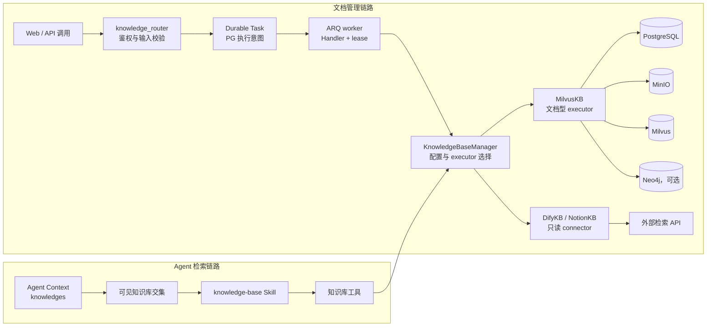
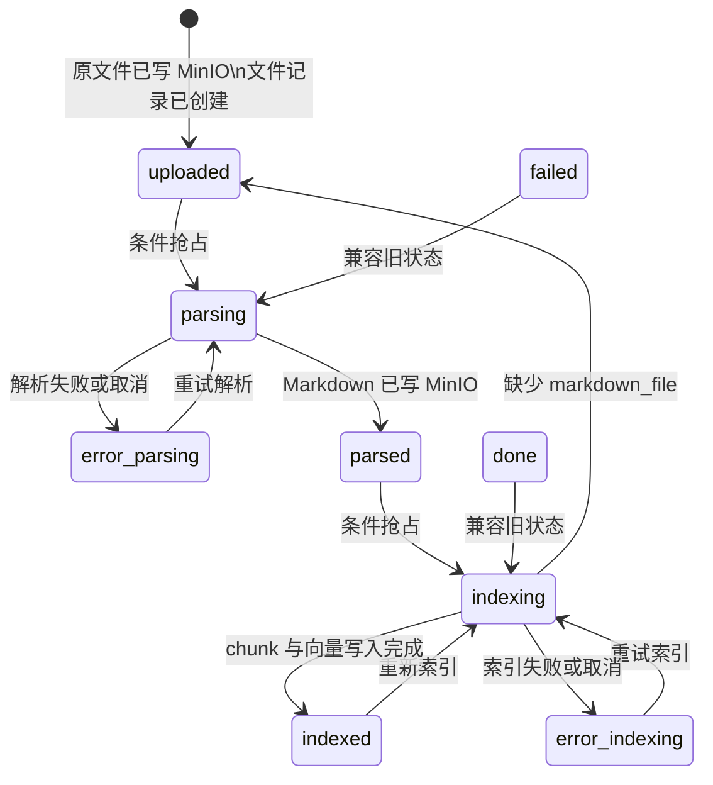

# 知识库机制详解

本页供开发者和运维人员查询知识库内部状态、存储边界、权限及 Agent 检索链路，重点说明文档从写入到可检索状态的运行机制。用户操作见[知识库教程](../intro/knowledge-base.md)，OCR、解析器与版面模型配置见[文档处理](../advanced/document-processing.md)。

## 知识库类型与能力边界

Yuxi 用 `KnowledgeBaseManager` 统一读取知识库元数据、解析权限并选择对应 executor，但不同 executor 的能力并不相同：

- `milvus` 是文档型知识库：支持上传、解析、分块、向量索引、内容预览与检索；可选知识图谱链路会把图数据写入 Neo4j。
- `dify`、`notion` 继承只读连接器基类：保存外部连接参数并执行 Query，不承载 Yuxi 的文档上传、解析、索引、文件树和全文预览流程。

知识库类型的工厂元数据和 executor 方法定义当前能力。前端按钮只投影这些能力，不参与最终判断。只读连接器收到文档操作时会显式抛错，调用方需要保留该失败结果。

## 两条主链路

管理链路负责改变知识库事实，Agent 链路只消费当前用户和当前 Agent 可见的知识库：

HTTP 路由只负责授权、请求编排和任务提交；知识库类型选择、配置回源和 executor 调用属于 `KnowledgeBaseManager`，具体解析、索引与检索属于 executor。知识库配置的业务事实来自 PostgreSQL；Redis 只缓存最小运行配置，缓存未命中必须回源 PostgreSQL。

## 文档状态机

文档上传与入库是三个可分别观察的动作。上传接口先把原文件写入 MinIO；`add_file_record` 再在 PostgreSQL 创建 `uploaded` 文件记录。解析和索引使用条件更新抢占状态，只有允许的前置状态可以成为当前动作 Owner：

`parsing` 和 `indexing` 声明当前动作的执行所有权，并参与并发控制。没有抢到允许状态的并发调用会显式失败，同一文件只能由一个调用继续处理。`parsed` 表示解析后的 Markdown 路径已写入文件记录；`indexed` 表示 executor 已完成当次分块、向量写入和统计更新。最终验证需要重新读取文件状态及对应存储产物，API 任务响应只提供调度结果。

## 存储 Owner 与一致性边界

| 存储 | 拥有的事实 | 不拥有的事实 |
| --- | --- | --- |
| PostgreSQL | 知识库配置、共享与归属、文件元数据和状态、chunk 正文与图谱处理状态、Durable Task 执行意图与 lease | 原文件字节、解析图片、向量相似度索引 |
| MinIO | 上传原件、解析后的 Markdown、解析图片 | 文件当前业务状态、用户是否有权读取 |
| Milvus | chunk 向量、BM25/混合检索所需字段、图实体与关系的向量索引 | 知识库权限、文件处理状态 |
| Neo4j | 可选知识图谱中的实体、关系和 chunk 关联 | 文档原件、向量检索结果、知识库授权 |
| Redis / ARQ | Durable Task 投递与 worker 唤醒、知识库最小运行配置缓存 | Task 最终状态、配置最终值和任何持久化文档状态 |

Milvus 文档索引会把同一批 chunk 并发写入 PostgreSQL 与 Milvus；任一侧失败时，实现尝试清理两侧数据并抛错，文件最终进入 `error_indexing`。该链路采用补偿式双写，不提供跨存储事务。故障排查需要同时核对 PostgreSQL chunk、Milvus chunk 和文件状态。

## Durable Task 编排与恢复语义

上传文件本身是同步对象存储动作；批量添加、解析、索引和图谱构建把 `task_type`、Handler 版本与可序列化 payload 持久化到 PostgreSQL，提交后再向 ARQ 发布 task_id。知识库、图谱与评估 Handler 位于各自 service，HTTP 路由不保存或传递 Python coroutine。

worker 通过条件更新取得唯一 attempt owner，并周期续租 `heartbeat_at/lease_expires_at`。重复 ARQ 消息无法取得同一 Task 的执行权；进度、结果和终态也只接受 lease 仍有效的当前 owner。Task 行锁事务在领域 callback 完成后使用 PostgreSQL 实时时钟再次验证 lease，失权时回滚整个 checkpoint 或终态投影。共享 worker 的 10 个 ARQ 槽中最多 4 个由 Durable Task claim 占用，剩余容量供 AgentRun 使用。评估领域的增量 checkpoint 通过 Task 行锁事务验证 attempt；文件进入 `parsing/indexing` 时保存 Task 与 attempt owner，进入和离开中间态都要求对应 Task 仍由该 owner 持有有效 lease。Task 失联、取消或失败时，failure hook 与 Task 终态在同一 PostgreSQL 事务中把仍由该 Task 拥有的文件改为 `error_parsing/error_indexing`，迟到 attempt 不能覆盖新状态。启动与周期 reconciler 收敛过期 lease，并补发 PG 中的 pending 意图。任务类型声明 `restart` 或 `fail`；当前知识 Handler 在外部副作用无法安全重放时明确失败。通用 runtime 不从 Python 调用栈猜测 checkpoint。

批量“处理待解析/待入库文档”和图谱任务使用数据库唯一 dedupe key，终态时释放该 key，防止多进程并发重复提交。取消 pending Task 会立即进入 cancelled；运行中的 Task 先持久化取消意图，由 worker 或 Handler 控制点完成清理后进入终态。LITE worker 不发布、claim、收敛或裁剪 knowledge Task，切回完整模式后再由注册 Handler 处理。Task 终态描述执行结局，文件记录状态仍是每个文档解析或索引的业务结局。

## Agent 可见性与工具激活

Agent 构建 runtime context 时按 `uid` 查询用户可访问知识库，再与 Agent Context 的 `knowledges` 列表取交集，结果作为运行期快照保存在 `_visible_knowledge_bases`。知识库工具优先复用该快照，仅在字段缺失时重新解析；传入的 `kb_id`、`file_id` 或名称必须属于快照。运行中途发生的权限撤销不会立即刷新现有 context，需要在新的运行时准备阶段生效。

知识库能力通过内置 `knowledge-base` Skill 暴露。模型读取该 Skill 的 `SKILL.md` 后，Skills middleware 才会开放七个依赖工具：`list_kbs`、`query_kb`、`find_kb_document`、`open_kb_document`、`get_mindmap`、`search_file` 和 `download_kb_file`。Skill 未激活时，这些工具会从模型可见列表中移除。ToolNode 注册只提供可执行实现，授权仍由可见集合和工具目标解析完成。

推荐调用顺序是“列出可见库 → 检索候选片段 → 按 `file_id` 打开或定位原文”。`download_kb_file` 只把有权访问的原始二进制写入当前线程 `outputs`，供代码工具进一步处理；知识库不会整体挂载到 `/home/gem/kbs`。外部只读连接器通常只能完成 Query，全文打开、文件搜索和下载应以 executor 的实际错误为准。

## 权限、共享与 LITE 边界

知识库的最终授权发生在后端依赖、manager 可见性查询和工具目标解析处。读取接口要求当前用户至少拥有 read 权限；更新配置、添加记录、解析、索引、删除和图谱管理要求对应 manage 权限。原文件上传入口还要求管理员身份，并在携带 `kb_id` 时继续校验该库的 manage 权限。共享规则由知识库记录与用户角色、部门等主体共同解析。前端路由守卫、按钮隐藏、prompt 提示和 schema omission 只控制呈现或缩小范围，不授予权限。

Agent 的 `knowledges` 配置只能缩小用户已经拥有的集合，不能扩大权限。SubAgent 沿用发起任务的用户身份，但从子 Agent 自己的 `config_json.context` 加载 `knowledges`，其配置集合可以与父 Agent 不同。工具按各自 runtime context 中的可见快照校验目标；新的 SubAgent 运行会在构建 context 时重新查询该用户权限。下载原件和读取私有解析图片也经后端鉴权代理，不能把 MinIO 对象 URL 当作公开授权凭证。

LITE 模式下 `knowledge_capability_enabled()` 返回关闭：知识库 Skill 不注册，Context 的知识库选项被禁用，可见集合解析为空，知识库工具包也不应进入发布启动路径。关闭状态定义产品能力边界；普通服务故障必须显式失败，不能返回空检索结果掩盖异常。

## 失败、重试与观察边界

- 解析失败或取消会把文件置为 `error_parsing` 并保存错误；再次解析允许从该状态重新抢占。批量“待解析”入口当前只扫描 `uploaded`，重试错误文件应明确选择文件。
- 索引失败或取消会置为 `error_indexing`；批量“待入库”会扫描 `parsed` 和 `error_indexing`。重新索引也允许从 `indexed` 与旧 `done` 状态开始。
- 索引发现 `markdown_file` 缺失时会把文件恢复为 `uploaded`，随后要求重新解析；该路径不会生成空索引。
- Durable Task 超时、取消或 lease 过期产生的 `failed` 不能直接推导文件状态；动作可能在写入部分外部存储后被中断，必须重新读取文件、chunk、向量和图谱状态。当前文档解析、索引和图谱任务采用 `fail` 策略，不在未知副作用上自动重放。
- Redis 配置缓存异常时 manager 应回源 PostgreSQL；不支持的知识库类型或已使用 executor 初始化失败会显式阻止初始化，不能静默换成其他持久化语义。

恢复操作从 PostgreSQL 文件状态和错误信息开始，再按状态检查 MinIO、PostgreSQL chunk、Milvus 与 Neo4j。重新提交任务前，先保留故障现场并确认同一文件没有活跃执行 Owner，再选择重新解析、重新索引或图谱修复入口。

## 源码定位与验证

| 要确认的事实 | 语义 Owner |
| --- | --- |
| 路由权限、上传、批量任务与状态筛选 | [knowledge_router.py](https://github.com/xerrors/Yuxi/blob/main/backend/server/routers/knowledge_router.py) |
| 配置回源、可见性与 executor 调度 | [knowledge/manager.py](https://github.com/xerrors/Yuxi/blob/main/backend/package/yuxi/knowledge/manager.py) |
| 通用文件状态与解析流程 | [knowledge/base.py](https://github.com/xerrors/Yuxi/blob/main/backend/package/yuxi/knowledge/base.py) |
| 分块、双写、Milvus 检索与重索引 | [implementations/milvus.py](https://github.com/xerrors/Yuxi/blob/main/backend/package/yuxi/knowledge/implementations/milvus.py) |
| 外部只读能力边界 | [read_only_connectors.py](https://github.com/xerrors/Yuxi/blob/main/backend/package/yuxi/knowledge/implementations/read_only_connectors.py) |
| Durable Task 提交、Handler registry、ARQ 投递与 lease | [task_service.py](https://github.com/xerrors/Yuxi/blob/main/backend/package/yuxi/services/task_service.py)、[task_registry.py](https://github.com/xerrors/Yuxi/blob/main/backend/package/yuxi/services/task_registry.py)、[task_queue_service.py](https://github.com/xerrors/Yuxi/blob/main/backend/package/yuxi/services/task_queue_service.py) |
| Agent 可见集合 | [knowledge_base_backend.py](https://github.com/xerrors/Yuxi/blob/main/backend/package/yuxi/agents/backends/knowledge_base_backend.py) |
| Skill 工具门控与七个工具实现 | [middlewares/skills.py](https://github.com/xerrors/Yuxi/blob/main/backend/package/yuxi/agents/middlewares/skills.py)、[kbs/tools.py](https://github.com/xerrors/Yuxi/blob/main/backend/package/yuxi/agents/toolkits/kbs/tools.py) |
| 知识图谱状态与 Neo4j 写入 | [milvus_graph_service.py](https://github.com/xerrors/Yuxi/blob/main/backend/package/yuxi/knowledge/graphs/milvus_graph_service.py) |

纯解析或配置变化先运行对应 knowledge unit；权限、上传、状态迁移和真实存储副作用至少运行 `backend/test/integration/api/test_knowledge_router.py`，外部连接器运行 `test_knowledge_external_router.py`。Durable Task 纯逻辑用 `test_tasker_behavior.py` 验证，claim/lease/去重用真实 PostgreSQL `test_durable_task_repository.py` 验证，LITE import 边界用 `test_lite_import_boundary.py` 验证。新增 guard 必须包含能恢复目标缺陷的负向案例，并从 PostgreSQL、MinIO、Milvus 或协议结果读取最终事实。
